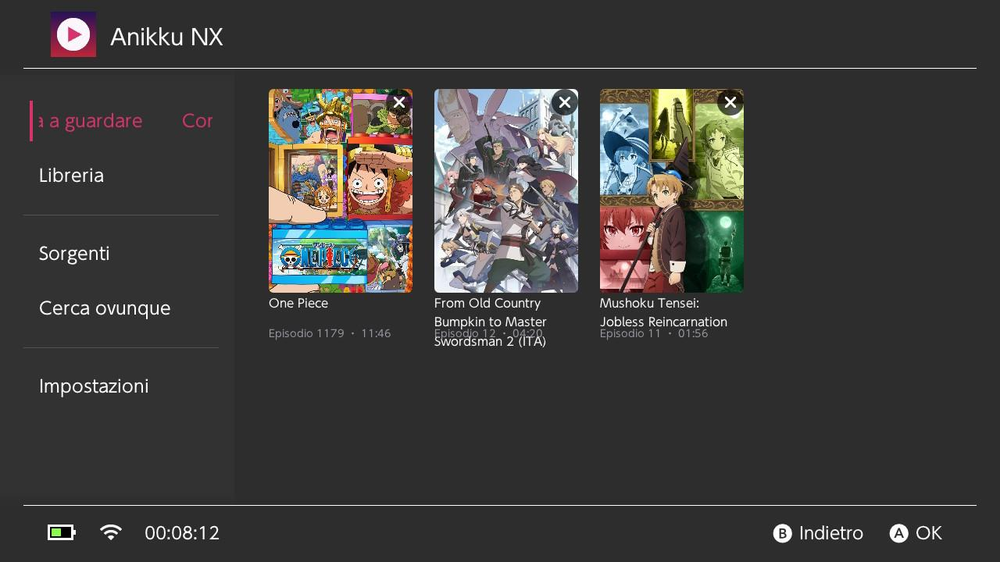
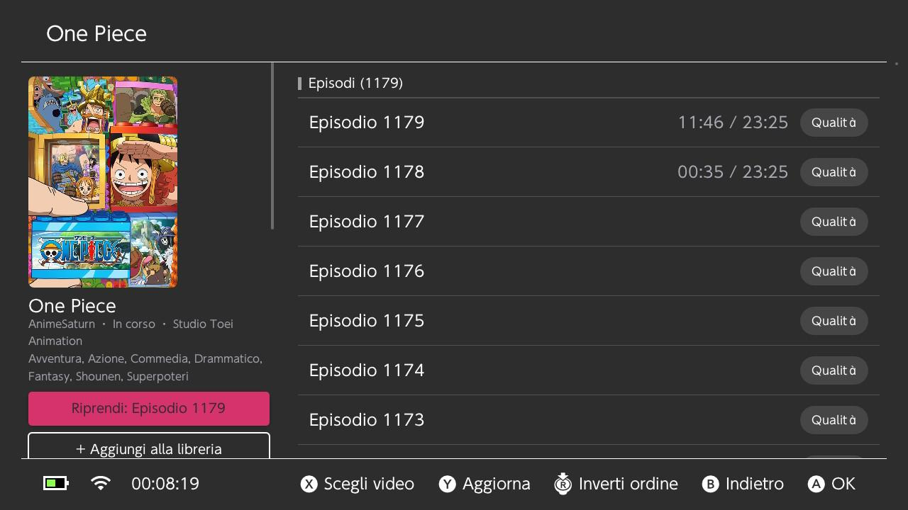
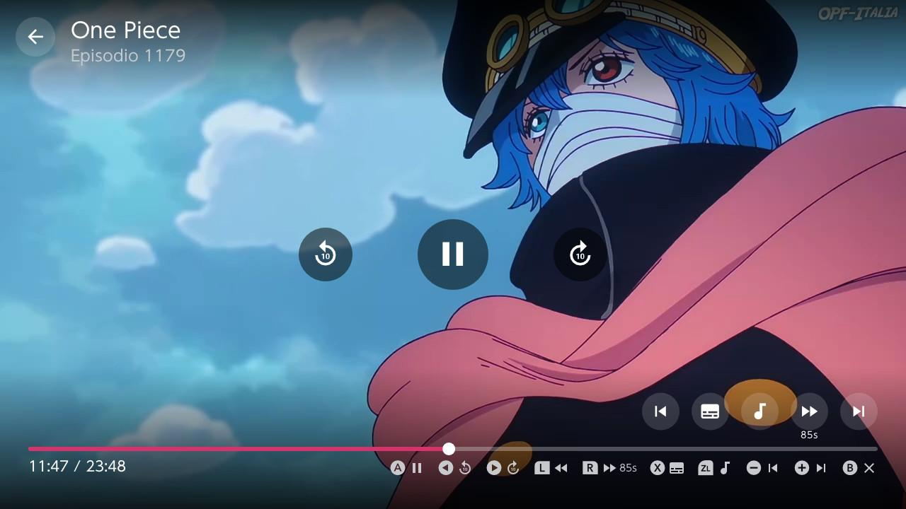

# AnikkuNX

**A standalone anime streaming app for the Nintendo Switch (homebrew), inspired by [Anikku](https://github.com/komikku-app/anikku) / [Aniyomi](https://github.com/aniyomiorg/aniyomi).**
No PC or server needed: the console talks to the sites directly. The Aniyomi source extensions were ported from Kotlin to C++.

🇮🇹 [Leggi in italiano](#italiano)

<p align="center">
  
  
  
</p>

## Features

- **Sources**: Italian (AnimeWorld, AnimeUnity, AnimeSaturn), English and multi-language sites. On first launch you pick
  which ones to enable, so the app stays light. You can change the choice later in *Settings → Choose sources*.
- **Player**: mpv with hardware decoding, HLS/MP4/DASH, external subtitles and audio tracks, resume from where you left off,
  automatic next episode.
- **Touch controls**: on-screen buttons, tap or drag the seek bar, double-tap left/right to seek, and swipe up/down
  on the left half (system volume) or the right half (screen brightness).
- **Library and history**, saved on the SD card. At startup the app checks your library for **new episodes**
  ("+N" badge, notification).
- **In-app updates** from the GitHub releases, with the changelog from [CHANGELOG.md](CHANGELOG.md).
- **Power saving**: no sleep while a video plays. When paused, the screen dims after 30 s and the console sleeps after 60 s.
- **UI in your console language**: Italian, English, Spanish, French, German, Portuguese, Dutch, Russian, Japanese,
  Korean and Chinese.

### Sources

| Language | Sources |
|---|---|
| Italian | AnimeWorld, AnimeUnity, AnimeSaturn |
| English | Anichi, Anikoto, AniWave, AnimeSogo, AnimeKai, KickAssAnime, WCO sites (Wcofun, WCOStream, WcoAnimeSub, WcoAnimeDub, WcoForever, WcoTv — recent episodes only), Animenosub, AnimeKhor, LuciferDonghua, DonghuaStream |
| Spanish | JKAnime, AnimeAV1, Latanime, MundoDonghua, VerAni.me, VerAnimes, BeatZ Anime, PelisPlus, Cineplus123, VerPelisTop |
| Portuguese | Animes Digital |
| French | Anime-Sama, Vostfree |
| German | AniWorld, AnimeToast |
| Arabic | Asia2TV, TukTukCinema |
| Russian | Animevost, YummyAnime |
| Indonesian | Samehadaku |
| Chinese | Xfani, Iyf, Nivod, Xiaoxintv |
| Serbian | AnimeBalkan |
| Multi | AnimeXin, LMAnime |
| 18+ (hidden, opt-in) | Hstream, HentaiHaven, HentaiMama, Oppai Stream |

Many more sites are ported (about 180 in total) but stay hidden until they pass the live test
(`testa-altre-lingue.bat`): several are behind Cloudflare, closed or blocked by some ISPs.
Sites change address often: you can set a new domain
per source in *Settings*, no rebuild needed.

## Install

1. Download `AnikkuNX.nro` from the [Releases](../../releases) page.
2. Copy it to `SD:/switch/AnikkuNX/AnikkuNX.nro`.
3. Launch the Homebrew Menu **by holding R while starting a game** (title mode). The player needs the full memory; applet
   mode (from the Album) doesn't have enough.

Requires a Switch with custom firmware (Atmosphère). Tested on Switch OLED, firmware 22.5.0.

## Controls

| Where | Button | Action |
|---|---|---|
| Everywhere | A / B | Open / back |
| Catalogue | Y | Search the source |
| Episode list | A / X / R3 | Play / choose quality / reverse order |
| Player | A | Pause / resume |
| Player | ◀ ▶ / L R | −10/+10 s / −85/+85 s (skip an opening) |
| Player | X / ZL | Cycle subtitles / audio track |
| Player | − / + | Previous / next episode |
| Player | B | Exit (progress is saved) |

## Build

- **GitHub Actions**: every push builds the `.nro` (artifact *AnikkuNX-nro*). Pushing a `v*` tag publishes a release.
- **Docker**: `docker run --rm -v "$PWD":/data devkitpro/devkita64 bash /data/switch/scripts/build_switch.sh`.
  The output is `dist/AnikkuNX.nro`.
- **Windows**: double-click `compila-switch.bat`. The first time it installs MSYS2 and devkitPro in `%LOCALAPPDATA%\AnikkuDev`.

`testa-fonti.bat` (Windows) builds `switch/tools/sourcetest.cpp`, a command-line check of every source against the live
sites. Use it when a site changes.

### Project layout

```
switch/src/sources/    source ports (one file per site or per shared "theme")
switch/src/net/        libcurl wrapper (shared cookies, CA bundle from romfs)
switch/src/html/       HTML parser (gumbo) + Jsoup-like CSS selectors
switch/src/util/       crypto (AES, MD5, SHA, RC4…), JS unpacker, i18n
switch/src/app/        library, history, progress (JSON on SD)
switch/src/activity/   borealis screens;  switch/src/view/  mpv player, covers (JPEG/PNG/WebP)
switch/resources/lang/ UI translations
```

To add a source, implement `src::Source` in `switch/src/sources/<name>.cpp` and register it in `registry.cpp`.
See [docs/porting.md](docs/porting.md).

## Disclaimer

AnikkuNX doesn't host, store or distribute any content. Like Aniyomi's extensions, it only reads pages that third-party
websites publish openly. The app isn't affiliated with those sites or with Nintendo. You're responsible for how you use
it and for following the laws of your country.

## Credits and licenses

AnikkuNX is released under the **GNU GPL v3** (see [LICENSE](LICENSE)).

- The sources are ports of the [Aniyomi extensions](https://github.com/yuzono/aniyomi-extensions) (Apache-2.0).
- [borealis](https://github.com/xfangfang/borealis) (Apache-2.0), [gumbo-parser](https://github.com/google/gumbo-parser) (Apache-2.0), [nlohmann/json](https://github.com/nlohmann/json) (MIT).
- [mpv](https://mpv.io) and [FFmpeg](https://ffmpeg.org) (LGPL/GPL), using the Switch packages from [wiliwili](https://github.com/xfangfang/wiliwili).
- [libnx](https://github.com/switchbrew/libnx) / devkitPro, and [Material Icons](https://fonts.google.com/icons) (Apache-2.0).
- [GNU FreeFont](https://www.gnu.org/software/freefont/) FreeSans (GPL-3.0 with font exception), used for Hindi, Arabic, Thai… characters.

---

## Italiano

**App autonoma per guardare anime su Nintendo Switch (homebrew), ispirata ad Anikku/Aniyomi.** Non serve nessun PC:
la console si collega direttamente ai siti.

- **Installazione**: scarica `AnikkuNX.nro` dalle [Release](../../releases) e copialo in `SD:/switch/AnikkuNX/`. Avvialo
  dall'Homebrew Menu tenendo premuto **R** mentre apri un gioco.
- **Fonti**: al primo avvio scegli quali attivare; si cambiano da *Impostazioni → Scegli le fonti attive*. Quelle 18+
  restano nascoste finché non attivi «Mostra fonti per adulti». Se un sito cambia dominio, puoi scrivere quello nuovo
  nelle Impostazioni.
- **Player touch**:
  - tocca lo schermo per mostrare i comandi, e tocca o trascina la barra per spostarti;
  - doppio tocco a sinistra o a destra per −10/+10 s;
  - scorri in verticale a sinistra per il volume di sistema, a destra per la luminosità.
- **Novità**: all'avvio l'app controlla i nuovi episodi degli anime in Libreria (badge "+N") e gli aggiornamenti
  dell'app su GitHub. Le note di ogni versione stanno in `CHANGELOG.md`.
- **Standby**: durante la riproduzione la console non va in standby. In pausa la luminosità si abbassa dopo 30 s e
  la console va in standby dopo 60 s.
- **Compilare su Windows**: doppio clic su `compila-switch.bat`.
